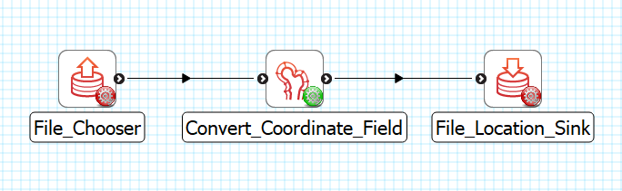

Convert Coordinate Field
========================

Overview
--------
The **Convert Coordinate Field** is MAP Client plugin for converting coordinate fields from one coordinate field to another.

Workflow Connections
--------------------

As shown in :numref:`fig-mcp-convert-coordinate-field-configured-step`, the **Convert Coordinate Field** uses 1 input:

1. A `Zinc library` compatible EX file from a **File Chooser** or other plugin. (Port: *https://opencmiss.org/1.0/rdf-schema#file_location*)

It produces 1 output which may be piped to other workflow steps:

1. An EX file after convert. (Port: *https://opencmiss.org/1.0/rdf-schema#file_location*)

.. _fig-mcp-convert-coordinate-field-configured-step:

   **Convert Coordinate Field** workflow connections.

Instructions
------------

.. _hdg-mcp-convert-coordinate-field-user-interface:

User Interface
~~~~~~~~~~~~~~

The *Convert Coordinate Field* step displays the fields found in the input file in a table.
The *Source Field* list, and *Field Type* list are fixed but you can select which *Re-evaluate in* field a source field should be re-evaluated in.
The fields are converted when the *Done* button is clicked.

.. _fig-mcp-merge-zinc-data-ui:

.. figure:: _images/convert-coordinate-field-ui.png
   :alt: Convert coordinate field user interface

   *Convert Coordinate Field* user interface, showing the *Source Field*, *Field Type*, and *Re-evaluate in* list of fields and conversion for some input data.
