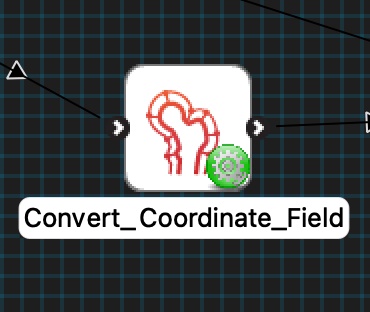
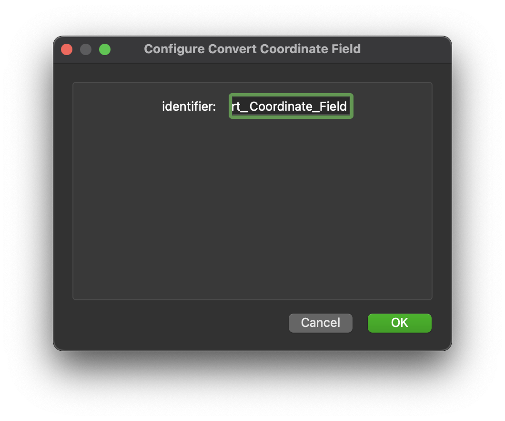
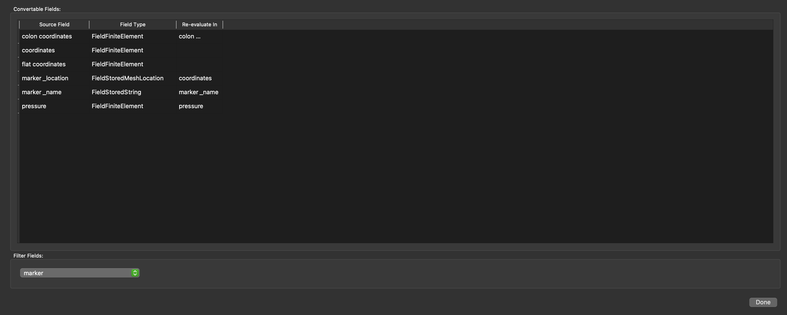

MAP Client Plugin - Convert Coordinate Field
============================================

The **Convert Coordinate Field** is MAP Client plugin for converting coordinate fields from one coordinate field to another.

.. _fig-mcp-convert-coordinate-field-configured-step:

   A configured *Convert Coordinate Field* step icon.

**Table of contents**

* :ref:`hdg-mcp-convert-coordinate-field-configure`
* :ref:`hdg-mcp-convert-coordinate-field-ports`
* :ref:`hdg-mcp-convert-coordinate-field-ui`

.. _hdg-mcp-convert-coordinate-field-configure:

Configure
---------

This step comes pre-configured.
The only configurable setting for this step is the step identifier.

.. _fig-mcp-convert-coordinate-field-configure-dialog:

   *Convert Coordinate Field* step configuration dialog.

.. _hdg-mcp-convert-coordinate-field-ports:

Ports
-----

This plugin:

* **uses**:

  * *https://opencmiss.org/1.0/rdf-schema#file_location*

and

* **provides**:

  * *https://opencmiss.org/1.0/rdf-schema#file_location*

The **uses** port is a Zinc exf file location.
The **provides** port is a Zinc exf file location.

.. _hdg-mcp-convert-coordinate-field-user-interface:

User Interface
--------------

The *Convert Coordinate Field* step displays the fields found in the input file in a table.
The *Source Field* list, and *Field Type* list are fixed but you can select which *Re-evaluate in* field a source field should be re-evaluated in.
The fields are converted when the *Done* button is clicked.

.. _fig-mcp-merge-zinc-data-ui:

   *Convert Coordinate Field* user interface, showing the *Source Field*, *Field Type*, and *Re-evaluate in* list of fields and conversion for some input data.
